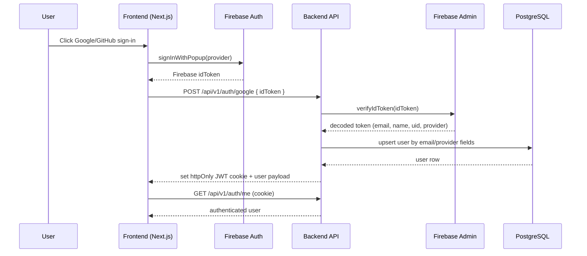
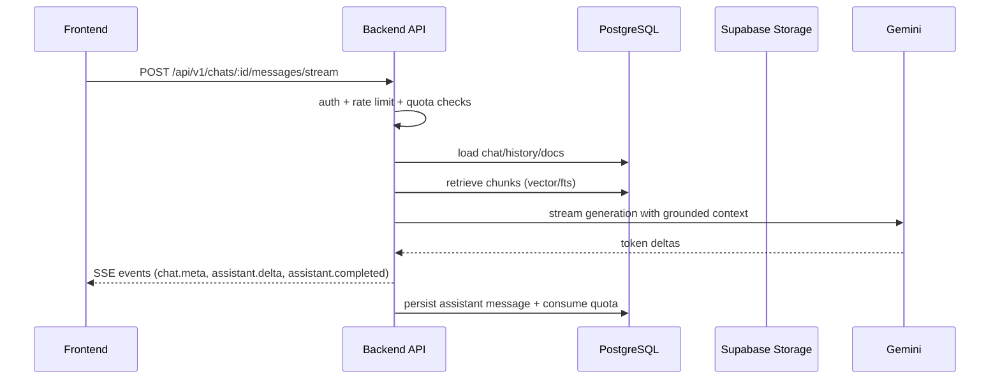
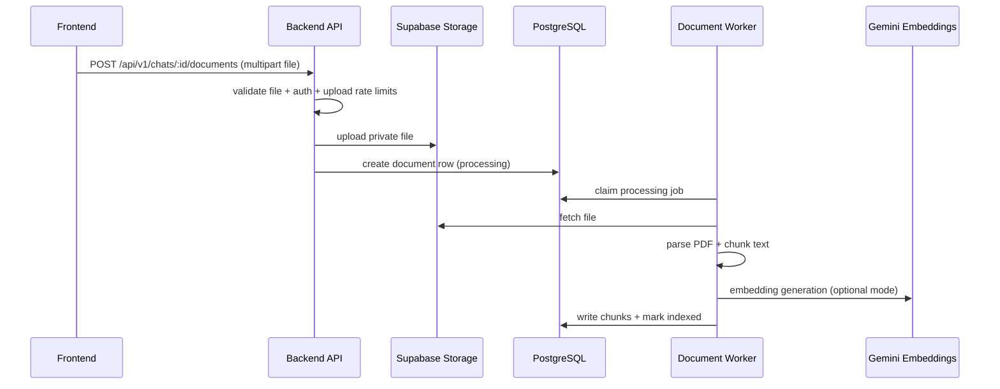

# System Architecture

Document Analyzer is a split deployment:

- Frontend: Next.js app on Vercel
- Backend: Express API on Render
- Data: PostgreSQL + Supabase Storage
- AI: Gemini API

## High-Level Components

- **Client (Web):** Authentication UI, chat workspace, upload flow, SSE stream handling
- **Firebase Auth (Client):** Google/GitHub provider login and ID token issuance
- **Backend API (Express):** Auth exchange, chat orchestration, upload handling, quota/rate limit guardrails
- **Firebase Admin SDK (Backend):** ID token verification
- **PostgreSQL (Supabase):** Users, chats, messages, documents, chunks, usage counters
- **Supabase Storage:** Private document binary storage
- **RAG Services:** Retrieval + grounding + response generation

## Request Flow (Auth)

## Request Flow (Chat + RAG)

## Request Flow (Upload + Indexing)

## Security Model

- Strict CORS allowlist for production domains
- JWT auth cookie is `httpOnly`; user identity derived server-side
- Firebase Admin verifies provider identity tokens
- Per-route validation with Zod
- Rate limiting:
  - global
  - auth route
  - chat routes
  - upload routes
- Private object storage for uploaded files

## Reliability & Failure Behavior

- Standardized API envelope for errors/success
- Streaming endpoint emits structured SSE error events
- Worker retry controls for document processing failures
- Readiness endpoint supports degraded mode when AI is unavailable

## Data Model (Auth-Relevant)

Primary user fields:

- `id`
- `email`
- `name`
- `avatar_url`
- `provider`
- `provider_id`

Legacy email/OTP auth flows are not part of active production behavior.
