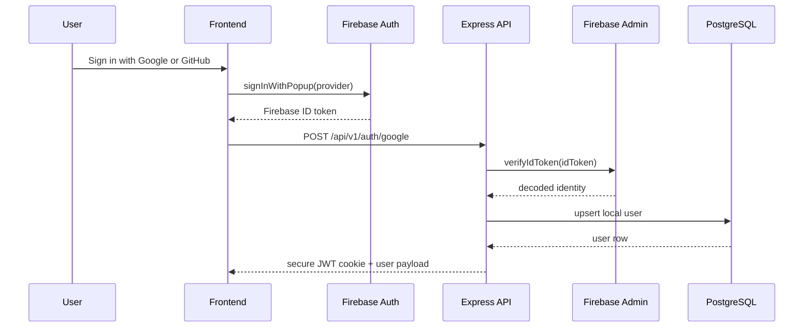
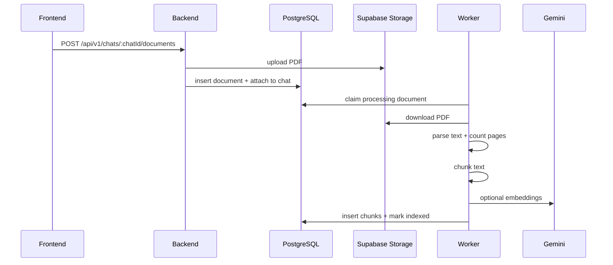

# Architecture

This document explains the current implementation in the repository. It reflects what the code does today, not an idealized target state.

## System Topology

```text
Browser
  |
  +-- Next.js frontend
  |     - Firebase popup auth
  |     - chat workspace state
  |     - upload progress
  |     - SSE parsing
  |
  +-- Express backend
        - auth exchange
        - chats/messages/documents API
        - quota + limits + health
        - worker bootstrap
        - RAG orchestration
        |
        +-- PostgreSQL / pgvector
        +-- Supabase Storage
        +-- Firebase Admin
        +-- Gemini generation + embeddings
```

## Deployment Shape

- Frontend:
  - Next.js app under `frontend/`
  - Vercel config in `frontend/vercel.json`
- Backend:
  - Express app at repo root
  - Render blueprint in `render.yaml`
- Data:
  - PostgreSQL schema defined in `database/schema.sql`
  - Supabase Storage bucket for original PDFs

## Backend Runtime

### Boot sequence

1. `src/server.js` initializes Firebase Admin.
2. The Express app starts with the configured host and port.
3. If `ENABLE_DOCUMENT_WORKER` is truthy, the document worker begins polling immediately.

### Express middleware stack

`src/app.js` applies:

1. `helmet`
2. `cors` with an allowlist
3. `cookie-parser`
4. mutation origin protection
5. global rate limiting
6. `morgan`
7. JSON and URL-encoded parsers
8. `/api/v1` routes
9. not-found handler
10. centralized error handler

## Authentication Flow

The frontend uses Firebase popup auth. The backend owns the application session.



### Important implementation details

- The active exchange endpoint is still named `POST /api/v1/auth/google`.
- That route also accepts GitHub logins because the backend relies on Firebase’s `sign_in_provider`.
- The backend cookie is `httpOnly`, `sameSite: none`, and `secure: true`.
- `requireAuth` also accepts Bearer tokens, though the frontend uses cookies.

## Chat Flow

### Frontend behavior

- The main chat UI lives at `/app`.
- Chats are loaded into React context with:
  - chat list
  - active thread
  - attachments
  - quota
  - health state
  - retry state
- The workspace auto-creates a chat if the user uploads a file or sends a message without an active one.

### Backend behavior

When `POST /api/v1/chats/:chatId/messages/stream` is called:

1. auth and rate limits are enforced
2. the chat is verified as owned by the caller
3. daily quota is checked under a PostgreSQL advisory lock
4. attached documents are loaded
5. recent message history is loaded
6. the user message is persisted
7. the backend retrieves relevant chunks
8. Gemini generates a response
9. SSE events are emitted
10. the assistant message is stored and quota is consumed

If the stream fails after the user message is inserted but before the assistant message is saved, the backend removes the failed user message to keep the conversation clean.

## Document Pipeline

The document pipeline is asynchronous.



### Queue model

- There is no Redis, BullMQ, SQS, or Kafka.
- The `documents` table acts as the queue.
- The worker polls for rows in `status = 'processing'`.
- Job claiming uses `FOR UPDATE SKIP LOCKED`.

### Retry model

- Retry eligibility is driven by:
  - generic runtime failures
  - storage download failures
  - AI temporary unavailability
- Failed jobs are retried up to `DOCUMENT_PROCESSING_MAX_RETRIES`.
- Permanent failure sets `documents.status = 'failed'` and stores a human-readable error message in `last_error`.

## RAG Architecture

### Chunking

- Text normalization removes repeated whitespace and collapses blank lines.
- Chunking is whitespace-token based, not page-aware or semantic-section aware.
- Each chunk stores:
  - `document_id`
  - `chunk_index`
  - `content`
  - optional `embedding`
  - generated `search_vector`

### Retrieval modes

#### `fts`

- Uses PostgreSQL `websearch_to_tsquery('english', query)`
- Ranks with `ts_rank_cd`
- Returns candidates ordered by score

#### `vector`

- Embeds the query with Gemini
- Orders by `embedding <-> queryVector`
- Falls back to FTS if:
  - query embedding fails
  - no vector rows exist for that chat’s documents

### Prompting

The prompt includes:

- recent conversation history
- retrieved chunk excerpts
- the raw user query
- instructions to prefer document context, but still answer even when retrieval is empty

This means the backend prompt builder supports fallback answers without document context. The frontend product deliberately blocks this path in the main UI until a document is indexed.

### Generation and streaming

- The code calls Gemini `generateContent`, not `generateContentStream`
- The backend wraps the response in an async generator and sends it over SSE
- In practice, the current server transport is streaming-shaped, but the model completion is collected before emission

## Frontend Architecture

### App router structure

- `src/app/page.tsx`: landing page
- `src/app/login/page.tsx`: login page
- `src/app/app/layout.tsx`: authenticated shell
- `src/app/app/page.tsx`: chat workspace
- `src/app/app/documents/page.tsx`: informational helper page
- `src/app/app/settings/page.tsx`: informational helper page

### Shared state

`use-chat-workspace.tsx` owns:

- chat list
- active chat id
- persisted messages
- in-flight assistant text
- attachments and upload progress
- quota and limits
- workspace health
- retry state

### Network model

- standard API calls use a shared `request()` wrapper
- uploads use `XMLHttpRequest` for progress callbacks
- chat responses use `fetch()` and manual SSE parsing
- document status is polled every 5 seconds during processing

## Data Model

### Core relations

- `users` -> `chats`
- `chats` -> `messages`
- `users` -> `documents`
- `chats` <-> `documents` through `chat_documents`
- `documents` -> `chunks`
- `users` -> `daily_chat_usage`

### Guardrails embedded in the schema

- duplicate messages are prevented with `UNIQUE (chat_id, client_message_id)`
- duplicate document content per user is prevented with `UNIQUE (user_id, document_hash)`
- `chat_documents` is capped at three rows per chat through a trigger
- `chunks.search_vector` is generated automatically

## Operational Endpoints

- `/api/v1/health/live`: liveness
- `/api/v1/health/ready`: readiness, including degraded AI mode
- `/api/v1/limits`: public configuration summary for the workspace
- `/api/v1/quota`: authenticated usage status

## Observed Constraints And Tradeoffs

- The frontend simplifies UX to one active attachment even though the backend supports three.
- Retrieval mode is configurable, but only one mode is active at a time.
- Vector retrieval is intentionally resilient because the code can keep indexing even when embedding generation fails.
- The worker is simple to operate because it stays inside the API process, but it couples ingestion throughput to that runtime footprint.
