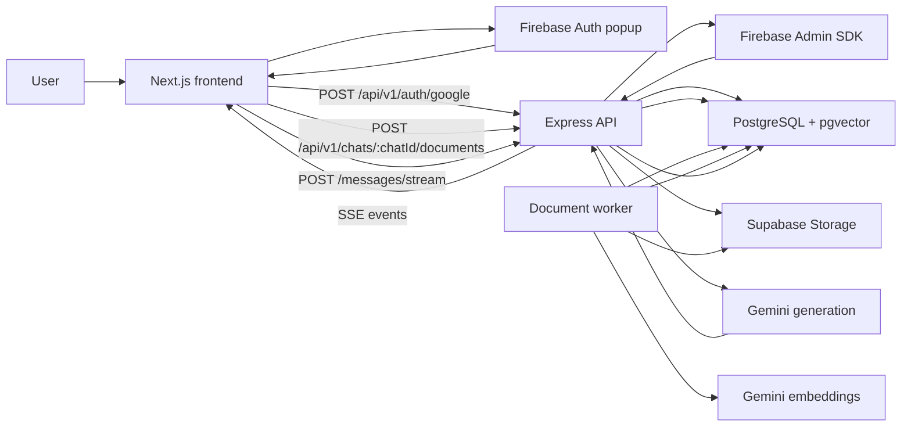
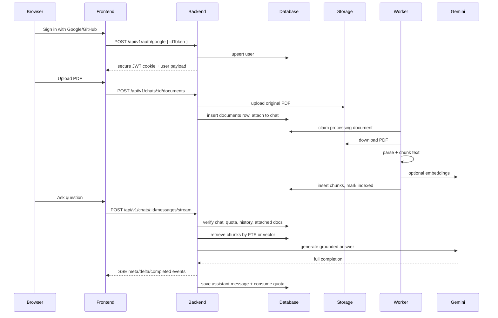

# Document Analyzer

[](https://github.com/saahilpal/RAG-DOCAnalyzer/actions/workflows/ci.yml)
[](https://nodejs.org/)
[](https://nextjs.org/)
[](./package.json)

Chat-first document Q&A workspace built with Next.js, Express, PostgreSQL, Supabase Storage, and Google Gemini.

This repository contains a split full-stack application:

- `frontend/`: a Next.js 16 web client
- `src/`: an Express 5 API
- `database/schema.sql`: PostgreSQL + `pgvector` schema bootstrap

The implementation is intentionally opinionated: the hosted web workspace centers each conversation around a single active PDF, while the backend and schema support up to three attached documents per chat.

## Highlights

- Firebase social sign-in with Google and GitHub on the frontend
- Backend-issued JWT session cookie after Firebase token verification
- Chat workspace with persistent conversations, pinning, renaming, and deletion
- PDF-only upload flow with upload progress, SHA-256 deduplication, and Supabase Storage persistence
- Asynchronous document indexing worker backed by database polling, not an external queue
- Retrieval-Augmented Generation using PostgreSQL full-text search or `pgvector`
- Automatic retrieval fallback from vector search to FTS when embeddings are unavailable
- SSE-based response delivery for chat replies
- Daily per-user chat quotas plus layered request rate limiting
- Health, readiness, quota, and workspace-limits endpoints
- Frontend polling for document indexing state and optimistic chat UX

## What The Code Actually Does

### Product constraints

- The web UI only allows one active document attachment at a time.
- The API and database allow up to three attachments per chat.
- Chat requests are blocked in the frontend until one attached document is fully indexed.
- The backend itself can still answer with empty retrieval and general-knowledge fallback if called directly without document context.

### Streaming behavior

- The client receives chat replies over Server-Sent Events.
- The backend emits `chat.meta`, `assistant.delta`, `assistant.completed`, and `error` events.
- Gemini generation currently uses `generateContent`, not upstream token streaming, so SSE is the delivery transport rather than true incremental model streaming.

## Architecture Overview

```text
+----------------------+        +---------------------------+
| Next.js Web Client   |        | Firebase Auth (client)    |
| - login              |<------>| - Google / GitHub popup   |
| - chat workspace     |        | - ID token issuance       |
| - upload progress    |        +---------------------------+
| - SSE parsing        |
+----------+-----------+
           |
           | HTTPS + cookies + multipart + SSE
           v
+----------+-----------+
| Express API          |
| - auth exchange      |
| - chats/messages     |
| - document attach    |
| - quota + limits     |
| - readiness checks   |
+----+-------------+---+
     |             |
     |             +-----------------------------+
     |                                           |
     v                                           v
+----+-------------------+          +------------+----------------+
| PostgreSQL / pgvector  |          | Supabase Storage            |
| - users                |          | - original PDF binaries     |
| - chats                |          +-----------------------------+
| - messages             |
| - documents            |
| - chat_documents       |
| - chunks               |
| - daily_chat_usage     |
+----+-------------------+
     |
     | polling worker claims processing rows
     v
+----+-------------------+
| Document Worker        |
| - download PDF         |
| - pdf-parse            |
| - whitespace chunking  |
| - optional embeddings  |
| - retry/failure logic  |
+----+-------------------+
     |
     v
+----+-------------------+
| Google Gemini          |
| - gemini-2.5-flash     |
| - gemini-embedding-001 |
+------------------------+
```

## Mermaid Diagram



## Request Flow



## Real RAG Pipeline

### 1. Upload

- The browser uploads a `multipart/form-data` request with a single `file` field.
- Multer stores the upload in memory.
- The backend only accepts PDFs and validates extension, MIME type, byte size, and `%PDF-` file signature.

### 2. Storage and deduplication

- A SHA-256 hash is computed from the uploaded bytes.
- If the same user already uploaded identical content, the existing document row is re-attached to the chat instead of re-uploading.
- New files are stored in Supabase Storage under `userId/timestamp-sanitized-name.pdf`.

### 3. Queueing for processing

- New documents are inserted into `documents` with `uploading`, then immediately moved to `processing`.
- There is no external queue system. The database itself is the work queue.
- The worker polls for `documents.status = 'processing'` and claims jobs with `FOR UPDATE SKIP LOCKED`.

### 4. Parsing and chunking

- The worker downloads the PDF from Supabase Storage.
- `pdf-parse` extracts plain text and page count.
- Documents exceeding `MAX_PAGES_PER_DOC` are rejected.
- Text is normalized and chunked by whitespace token count using:
  - `RAG_CHUNK_TOKENS`
  - `RAG_CHUNK_OVERLAP_TOKENS`

### 5. Embedding and indexing

- If `RETRIEVAL_MODE=vector`, the worker requests Gemini embeddings in batches of 24 chunks.
- Embeddings are stored in `chunks.embedding` as `vector(384)` literals.
- Full-text search support is always present through the generated `search_vector` column.
- If embedding generation fails, chunks are still stored without vectors and retrieval can fall back to FTS later.

### 6. Retrieval

- Full-text mode:
  - uses `websearch_to_tsquery('english', query)`
  - ranks with `ts_rank_cd`
  - limits candidates by `RAG_CANDIDATE_PAGE_SIZE`
  - returns top `RAG_TOP_K`
- Vector mode:
  - embeds the query with Gemini
  - orders results by `embedding <-> queryVector`
  - falls back to FTS if query embedding fails or no vector rows are available

### 7. Prompt construction

- The backend includes recent chat history and retrieved chunk excerpts in a single prompt.
- Chunk text is trimmed by a character budget derived from `RAG_CHUNK_TOKENS * RAG_TOKEN_TO_CHAR_RATIO`.
- Retrieved context is labeled as `[Source N | fileName | chunk index]`.

### 8. Answer generation

- Gemini generates a completion from the assembled prompt.
- The backend emits SSE events to the client.
- On success, the assistant message is persisted and daily quota is incremented.
- On failure after the user message is written but before completion, the backend removes the failed user message to keep the thread clean.

## Tech Stack

| Layer | Implementation |
| --- | --- |
| Frontend | Next.js 16, React 19, TypeScript, Tailwind CSS 4, Framer Motion |
| Frontend auth | Firebase Web SDK |
| Frontend rendering | App Router, client-side context state, `fetch` + `XMLHttpRequest` |
| Backend | Node.js, Express 5, CommonJS |
| Validation | Zod |
| Uploads | Multer memory storage |
| Database | PostgreSQL |
| Vector search | `pgvector` with optional HNSW index |
| File storage | Supabase Storage |
| AI generation | Google Gemini (`gemini-2.5-flash`) |
| Embeddings | Google Gemini (`gemini-embedding-001`) |
| Tests | Node test runner + Supertest, Vitest + Testing Library |
| Deploy config | Render blueprint, Vercel config, GitHub Actions CI |

## Frontend Overview

### Routes

- `/`: marketing landing page
- `/login`: social sign-in entry
- `/signup`: redirect to `/login`
- `/forgot-password`: redirect to `/login`
- `/app`: primary chat workspace
- `/app/documents`: informational page that points users back to the chat-centric document flow
- `/app/settings`: informational page that points users to the in-app settings panel

### State management

- `AuthProvider` restores the user with `GET /api/v1/auth/me` and reacts to expired-session events.
- `ChatWorkspaceProvider` owns chat list, active thread, attachments, quota, health state, retry state, and SSE message assembly.
- No Redux, Zustand, or React Query is used. State is local React context plus `useState`, `useEffect`, `useMemo`, and `useCallback`.

### Network layer

- Standard API calls use a shared `request()` helper with `credentials: 'include'`.
- Uploads use `XMLHttpRequest` to expose upload progress.
- Chat replies use a `fetch()` POST request and manually parse the SSE response body.
- Document status updates are polled every 5 seconds while uploads are processing.

### UX flow

1. Sign in with Google or GitHub.
2. Enter the workspace.
3. Create or select a chat.
4. Upload a single PDF.
5. Wait for processing to reach `indexed`.
6. Ask a question and receive the assistant answer over SSE.

## Backend Overview

### Main modules

- `src/app.js`: Express bootstrap, CORS, Helmet, cookie parsing, JSON parsing, global limiter
- `src/routes/`: route registration
- `src/controllers/`: HTTP handlers
- `src/services/`: auth, chats, documents, worker, Gemini, quota, health, RAG, storage
- `src/middlewares/`: auth, origin guard, validation, rate limits, errors
- `src/utils/`: API envelopes, SSE helpers, chunking, vector conversion, error types

### Authentication model

- The frontend authenticates with Firebase popup providers.
- The backend verifies the Firebase ID token using Firebase Admin.
- The backend upserts a local user row and returns a JWT in:
  - an `httpOnly` cookie
  - the JSON response body
- The active route is named `POST /api/v1/auth/google`, but it also accepts GitHub-backed Firebase sessions.

### Security controls

- Strict CORS allowlist
- Mutation origin guard using `Origin` or `Referer`
- `httpOnly` JWT cookie
- Optional Bearer token support in `requireAuth`
- Global limiter plus auth/chat/upload route limiters
- Request validation with Zod

## Database Model

### Tables

- `users`: local identity records
- `chats`: chat metadata per user
- `messages`: user and assistant turns
- `documents`: uploaded PDF records and indexing status
- `chat_documents`: join table between chats and documents
- `chunks`: chunk text, optional embedding vector, generated `tsvector`
- `daily_chat_usage`: daily request counters per user

### Relationships

- one `users` row -> many `chats`
- one `chats` row -> many `messages`
- one `users` row -> many `documents`
- many-to-many between `chats` and `documents` via `chat_documents`
- one `documents` row -> many `chunks`

### Notable schema details

- unique `(chat_id, client_message_id)` prevents duplicate user message persistence
- unique `(user_id, document_hash)` enables content deduplication
- trigger on `chat_documents` enforces a hard maximum of 3 attached documents per chat
- optional HNSW index is created only if `vector_cosine_ops` exists in the database

## API Documentation

All JSON endpoints return:

```json
{
  "ok": true,
  "data": {}
}
```

or

```json
{
  "ok": false,
  "error": {
    "code": "ERROR_CODE",
    "message": "Human readable message",
    "details": []
  }
}
```

### System

| Method | Path | Auth | Notes |
| --- | --- | --- | --- |
| `GET` | `/api/v1/health` | No | alias of live health |
| `GET` | `/api/v1/health/live` | No | liveness check |
| `GET` | `/api/v1/health/ready` | No | readiness check, may return degraded `chat_only` mode |
| `GET` | `/api/v1/limits` | No | model, retrieval mode, worker flag, workspace limits, repo links |
| `GET` | `/api/v1/quota` | Yes | current user daily usage |

### Auth

| Method | Path | Auth | Notes |
| --- | --- | --- | --- |
| `POST` | `/api/v1/auth/google` | No | exchanges Firebase ID token for backend session; works for Google and GitHub Firebase providers |
| `POST` | `/api/v1/auth/logout` | No | clears auth cookie |
| `GET` | `/api/v1/auth/me` | Yes | returns current user |

### Chats

| Method | Path | Auth | Notes |
| --- | --- | --- | --- |
| `GET` | `/api/v1/chats?limit=50` | Yes | list chats |
| `POST` | `/api/v1/chats` | Yes | create chat |
| `GET` | `/api/v1/chats/:chatId` | Yes | fetch single chat |
| `PATCH` | `/api/v1/chats/:chatId` | Yes | update title and/or pinned |
| `DELETE` | `/api/v1/chats/:chatId` | Yes | delete chat |
| `GET` | `/api/v1/chats/:chatId/messages?limit=200` | Yes | list persisted messages |
| `POST` | `/api/v1/chats/:chatId/messages/stream` | Yes | chat request over SSE |
| `GET` | `/api/v1/chats/:chatId/documents` | Yes | list attached documents |
| `POST` | `/api/v1/chats/:chatId/documents` | Yes | upload and attach PDF |
| `DELETE` | `/api/v1/chats/:chatId/documents/:documentId` | Yes | detach document, deleting the storage object if no chats still reference it |

### SSE event contract

- `chat.meta`
  - `{ chatId, userMessageId }`
- `assistant.delta`
  - `{ text }`
- `assistant.completed`
  - `{ assistantMessage, quota }`
- `error`
  - `{ code?, message }`

## Project Structure

```text
.
├── .github/workflows/ci.yml      # CI for backend tests and frontend lint/build
├── database/schema.sql           # PostgreSQL + pgvector schema bootstrap
├── frontend/                     # Next.js application
│   ├── src/app/                  # App Router pages and layouts
│   ├── src/components/           # UI, chat, auth, and layout components
│   ├── src/hooks/                # Auth and chat workspace state
│   └── src/lib/                  # API client, Firebase client, utilities
├── src/                          # Express application
│   ├── config/                   # env, logger, Firebase, Supabase, Gemini
│   ├── controllers/              # thin HTTP handlers
│   ├── middlewares/              # auth, validation, origin/rate/error controls
│   ├── routes/                   # route registration
│   ├── services/                 # business logic and worker/RAG implementation
│   ├── utils/                    # chunking, SSE, API envelope, vector helpers
│   └── validations/              # Zod schemas
├── tests/                        # backend tests
├── ARCHITECTURE.md               # detailed system and flow notes
├── BACKEND_DOCS.md               # endpoint-level backend reference
├── CONTRIBUTING.md               # contributor workflow
└── ROADMAP.md                    # next improvements grounded in the current codebase
```

## Quick Start

### 1. Install dependencies

```bash
npm install
npm --prefix frontend install
```

### 2. Configure environment variables

Backend:

```bash
cp .env.example .env
```

Frontend:

```bash
cp frontend/.env.example frontend/.env.local
```

### 3. Bootstrap the database schema

```bash
npm run db:schema
```

This executes `database/schema.sql` directly against `DATABASE_URL`.

### 4. Start both apps

Backend:

```bash
npm run dev
```

Frontend:

```bash
npm run frontend:dev
```

### 5. Verify the API

```bash
curl http://localhost:4000/api/v1/health/live
curl http://localhost:4000/api/v1/limits
```

## Required Environment Variables

### Backend essentials

- `DATABASE_URL`
- `SUPABASE_URL`
- `SUPABASE_SERVICE_KEY`
- `SUPABASE_STORAGE_BUCKET`
- `GEMINI_API_KEY`
- `JWT_SECRET`
- `CORS_ORIGIN`

### Backend auth

- `FIREBASE_PROJECT_ID`
- `FIREBASE_CLIENT_EMAIL`
- `FIREBASE_PRIVATE_KEY`

### Backend RAG and worker tuning

- `RETRIEVAL_MODE`
- `EMBEDDING_DIMENSION`
- `RAG_TOP_K`
- `RAG_CANDIDATE_PAGE_SIZE`
- `RAG_CHUNK_TOKENS`
- `RAG_CHUNK_OVERLAP_TOKENS`
- `ENABLE_DOCUMENT_WORKER`
- `WORKER_POLL_INTERVAL_MS`

### Frontend essentials

- `NEXT_PUBLIC_API_URL`
- `NEXT_PUBLIC_FIREBASE_API_KEY`
- `NEXT_PUBLIC_FIREBASE_AUTH_DOMAIN`
- `NEXT_PUBLIC_FIREBASE_PROJECT_ID`
- `NEXT_PUBLIC_FIREBASE_APP_ID`

## Local Development Notes

- The backend currently sets `sameSite: 'none'` and `secure: true` on the auth cookie for every environment.
- That matches production cross-site deployment, but plain `http://localhost` browser sessions may need HTTPS or local cookie-setting adjustments during development.
- The frontend does not persist the backend token manually; it expects the cookie flow to work.

## Quality Checks

Backend:

```bash
npm test
```

Frontend:

```bash
npm run frontend:test
npm run frontend:lint
npm run frontend:build
```

## Deployment Shape

### Backend

- `render.yaml` defines a Node web service
- health check path: `/api/v1/health/live`
- worker enabled by environment flag
- Render blueprint includes all key AI, storage, auth, and quota settings

### Frontend

- `frontend/vercel.json` configures Vercel for Next.js
- production API URL defaults to `https://api.docanalyzer.app` when the build sees a localhost API URL

## Open-Source Readiness

- Contribution guide: [CONTRIBUTING.md](./CONTRIBUTING.md)
- Roadmap: [ROADMAP.md](./ROADMAP.md)
- Architecture notes: [ARCHITECTURE.md](./ARCHITECTURE.md)
- Backend reference: [BACKEND_DOCS.md](./BACKEND_DOCS.md)

## License

`package.json` declares the project license as `ISC`.

At the time of writing, the repository does not include a dedicated root `LICENSE` file, so adding one would be a good final packaging step before broader distribution.

## Acknowledgements

- Firebase Authentication and Firebase Admin SDK
- Supabase Postgres and Storage
- Google Gemini
- Next.js, React, Express, Zod, `pgvector`, and Framer Motion
