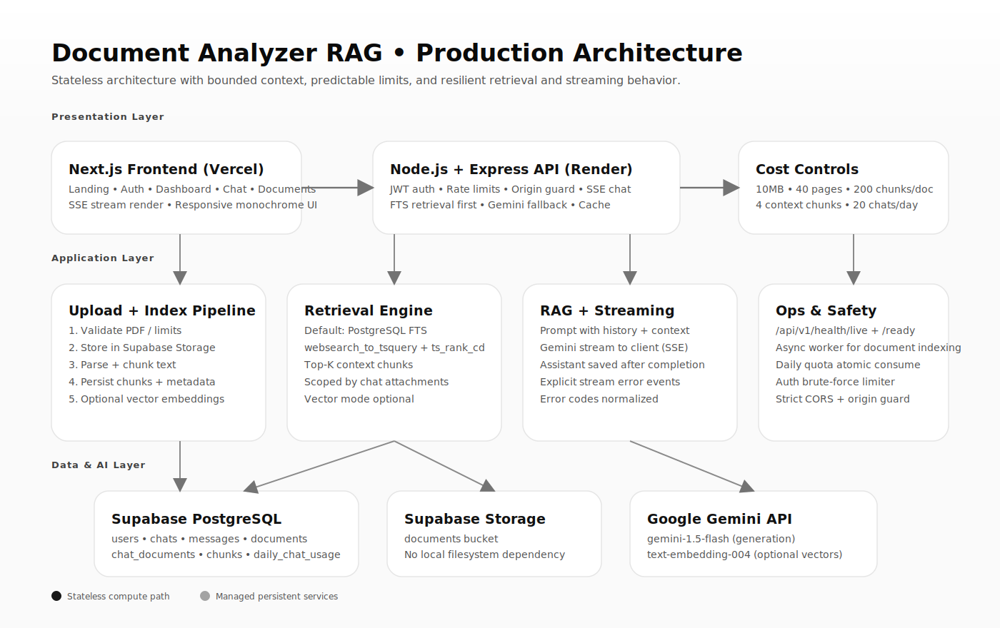
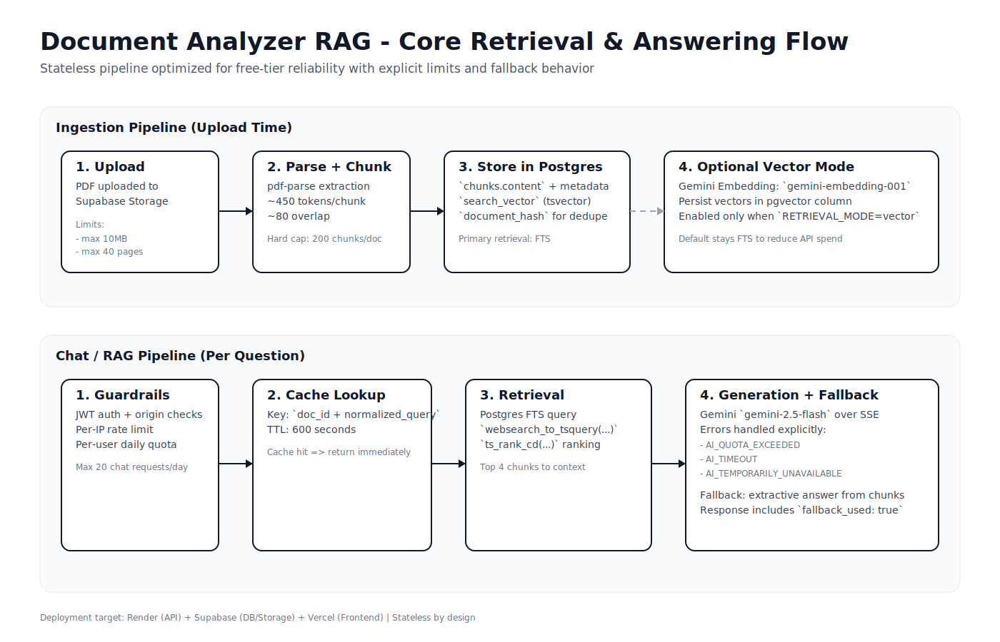

# Document Analyzer RAG

Chat with your documents in a clean, chat-first AI workspace.

## Overview

Document Analyzer RAG is built for focused document Q&A rather than generic chatbot behavior. Users upload a PDF, see it move through upload and processing states inside the chat timeline, then ask specific follow-up questions once the document is ready.

The stack combines a Next.js frontend, an Express backend, Supabase storage, PostgreSQL retrieval, Gemini generation, and SMTP-based email delivery.

## Product Highlights

- Chat-only document workflow with upload, processing, and ready states in the thread
- Strict document-grounded responses with guidance for vague or overly broad prompts
- Streaming assistant responses over SSE
- Email + password auth with email verification and password reset codes
- Persistent chat controls: rename, pin, delete
- Daily usage quota and workspace diagnostics
- Vector retrieval with automatic PostgreSQL FTS fallback
- Private Supabase Storage references for uploaded files

## Architecture

### System View

<p align="center">
  
</p>

### RAG Flow

<p align="center">
  
</p>

For additional architecture notes, see [`docs/ARCHITECTURE.md`](./docs/ARCHITECTURE.md).

## Tech Stack

- Frontend: Next.js, React, Tailwind CSS, Framer Motion
- Backend: Node.js, Express
- Database: PostgreSQL (Supabase)
- Storage: Supabase Storage
- AI: Google Gemini
- Email: Nodemailer over Gmail SMTP
- Deployment: Vercel (frontend), Render (backend)

## Quick Start

### 1. Install dependencies

```bash
npm install
cd frontend && npm install
```

### 2. Configure environment variables

Backend:

```bash
cp .env.example .env
```

Frontend:

```bash
cd frontend
cp .env.example .env.local
```

Required backend variables:

- `DATABASE_URL`
- `SUPABASE_URL`
- `SUPABASE_SERVICE_KEY`
- `GEMINI_API_KEY`
- `JWT_SECRET`
- `CORS_ORIGIN`
- `EMAIL_USER`
- `EMAIL_PASS`
- `EMAIL_FROM`

Required frontend variable:

- `NEXT_PUBLIC_API_URL`

### 3. Initialize and run

Use `npm run db:schema` only against a fresh or disposable database. The schema file recreates core tables.

From the repo root:

```bash
npm run db:schema
npm run dev
```

In a second terminal:

```bash
cd frontend
npm run dev
```

### 4. Local workflow

1. Sign up with email and password.
2. Verify the emailed OTP code.
3. Upload a PDF in the chat workspace.
4. Wait for the assistant to say the document is ready.
5. Ask focused questions about the uploaded document.

## Deployment

Deployment references:

- Backend blueprint: [`render.yaml`](./render.yaml)
- Frontend config: [`frontend/vercel.json`](./frontend/vercel.json)
- Checklist: [`DEPLOYMENT_CHECKLIST.md`](./DEPLOYMENT_CHECKLIST.md)

Production notes:

- Keep the Supabase `documents` bucket private.
- Set `NODE_OPTIONS=--dns-result-order=ipv4first` on Render.
- Use a Gmail App Password for `EMAIL_PASS`.
- Set `CORS_ORIGIN` to the exact frontend origin.

## Verification

From the repo root:

```bash
npm test
npm run frontend:test
npm run frontend:lint
npm run frontend:build
```

Recommended manual checks:

1. Create an account, verify email, and log in.
2. Upload a PDF and confirm the chat shows processing, then ready.
3. Ask a specific document question and confirm the answer streams.
4. Try a vague prompt such as `what is this` and confirm the app asks for a more specific question.

## About

Built by Sahil Pal.

- GitHub: [`saahilpal`](https://github.com/saahilpal)
- LinkedIn: [`sahiilpal`](https://www.linkedin.com/in/sahiilpal)
